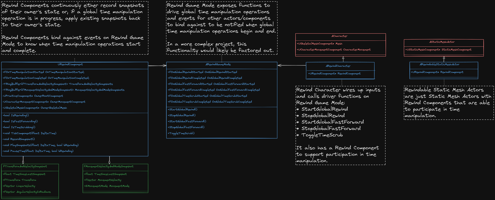
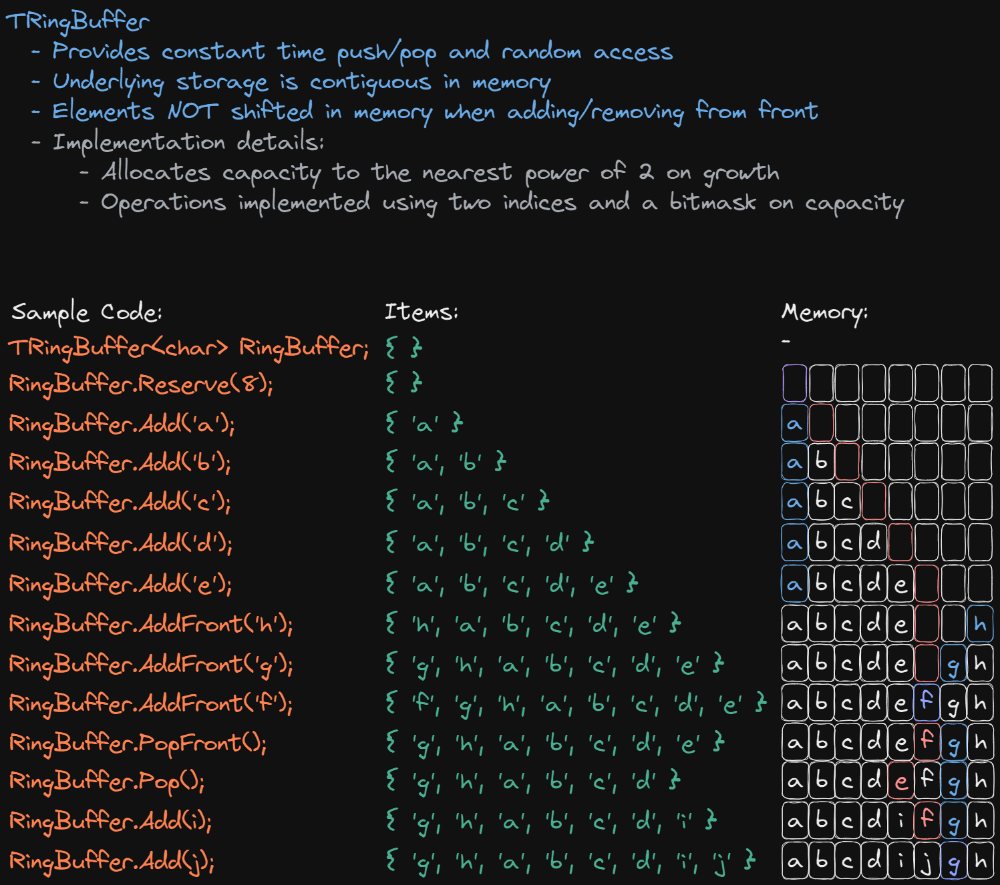

# Rewind
This repository contains a C++ prototype project implementing time rewinding mechanics in Unreal Engine 5. Check out [this video](https://www.youtube.com/watch?v=Y0SQuojLbxQ) for an overview of the project.

## Running the project
To load this project in your local editor, you first need to build the project from source. Check out my video on [setting up Visual Studio with UE5](https://youtu.be/HQDskHVw1to?si=ZjCnBW8VtGosY5xw) for a tutorial.

Alternatively, if you just want to play with the project, you can download a built version of the game client from the Releases section of this repository.

## Demos
Demos from the videos are stored as World Partition Data Layers on the map. You can activate them manually from the Data Layers outliner (Window -> World Partition -> Data Layers Outliner) or at runtime using the hotkeys specified below.

## Hotkeys
- **Left Mouse Button**: Player character shoots a sphere
- **T**: Toggles player character participation in time manipulation operations
- **R**: Hold to rewind time; release to stop rewinding
- **Left Control**: Toggle time scrubbing (freezes time)
- **F**: Hold to fastforwaard time; only available while time scrubbing
- **G**: Toggles visualization of snapshots (note this debug feature is currently quite slow with a large number of snapshots and will degrade performance)
- **1**: Sets rewind and fastforward speed to quarter real time
- **2**: Sets rewind and fastforward speed to half real time
- **3**: Sets rewind and fastforward speed to real time
- **4**: Sets rewind and fastforward speed to double real time
- **5**: Sets rewind and fastforward speed to quadruple real time
- **Numpad 1**: Toggles data layer for falling bridge
- **Numpad 2**: Toggles data layer for falling bridge that starts higher up
- **Numpad 3**: Toggles data layer for moving platforms
- **Numpad 4**: Toggles data layer for three stacks of barrels
- **Numpad 5**: Toggles data layer for giant cube falling onto a barrel stack

## Diagrams
Here are the diagrams that were discussed in more detail in the [video](https://www.youtube.com/watch?v=Y0SQuojLbxQ).

### Rewind Classes

### TRingBuffer Overview

## Special Thanks
Many of the static meshes used in this prototype are from the KayKit: Prototype Bits asset pack by Kay Lousberg. You can find the asset pack at https://kaylousberg.itch.io/prototype-bits and see all of Kay's fantastic work at https://www.kaylousberg.com!
